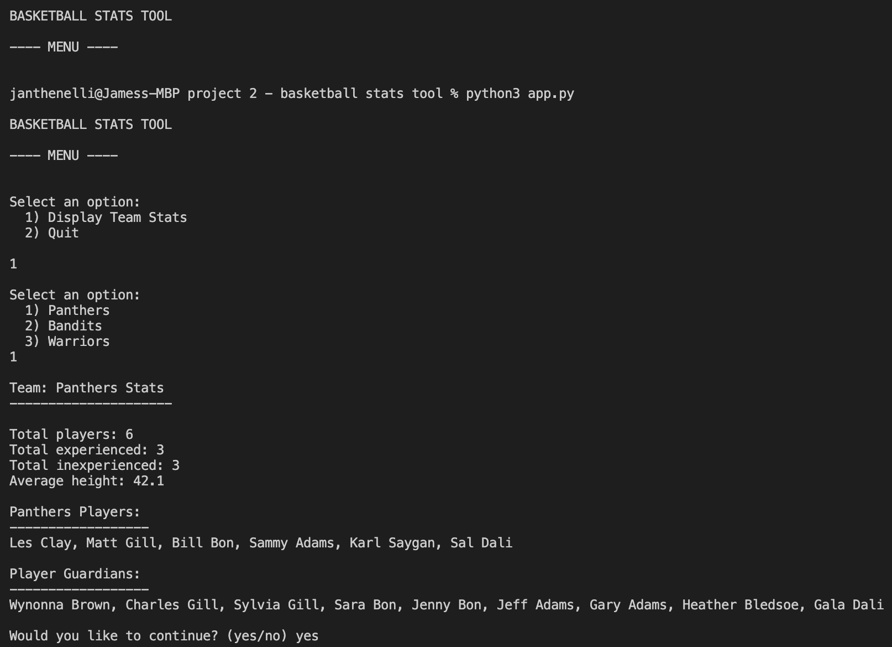

# Python-Basketball-Stats-Tool

This is a command line interface that extracts basketball players from an object list in a seperate file and assigns them to teams at runtime. Teams are randomly generated and balanced to have the same amount of players, as well as equal numbers of experienced vs inexperienced players. 

